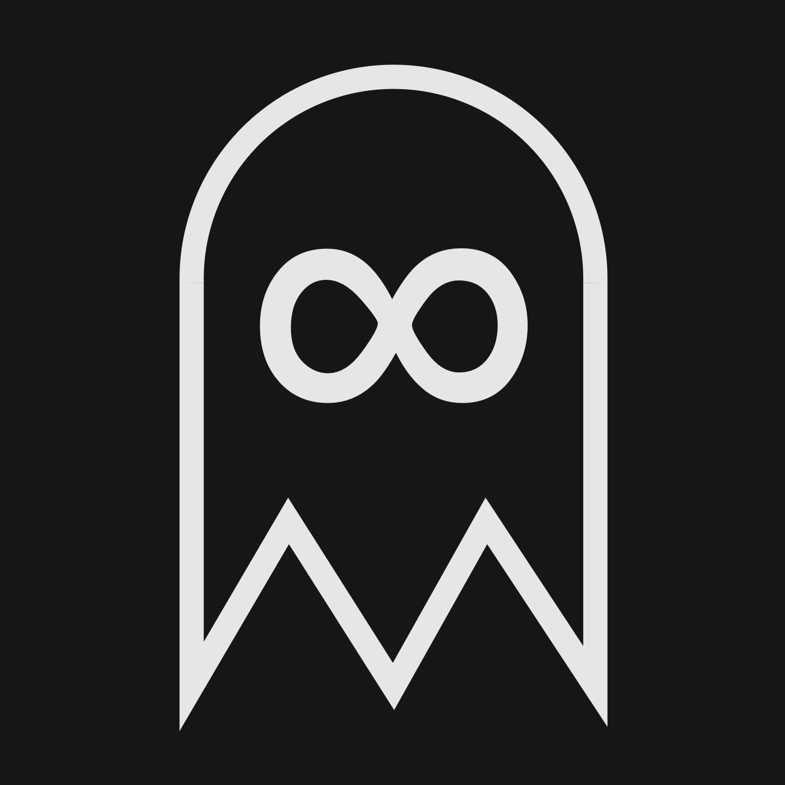

<!----- BEGIN GHOST DOCS LOGO src="./assets/logo.png" ----->

<div align="center">

</div>

<!----- END GHOST DOCS LOGO ----->

<!----- BEGIN GHOST DOCS HEADER ----->

# Wraith Ci

[](https://github.com/jill64/wraith-ci/actions/workflows/ci.yml) [](https://github.com/jill64/wraith-ci/actions/workflows/wraith-ci.yml) [](https://github.com/apps/wraith-ci) [](https://github.com/jill64/octoflare)

👻 CI suite in the dark

<!----- END GHOST DOCS HEADER ----->

## Ghost Bump

For each pull request event (open, sync, reopen), check if the version is up-to-date.

Head Version > Base Version

If the condition is not met, version bumping is performed and pushed based on the latest version with the following conditions.

| type  | PR title prefix (case insensitive) |
| ----- | ---------------------------------- |
| major | `breaking:`, `major:`              |
| minor | `feat:`, `minor:`                  |
| patch | `fix:`, other...                   |

## Ghost Release

### npm

| Event                 | Command       |
| --------------------- | ------------- |
| push (default_branch) | `npm publish` |

#### Environment Variable

| KEY         | description           |
| ----------- | --------------------- |
| `NPM_TOKEN` | npm token for publish |

### GitHub Release

Content of release notes is automatically generated by GitHub.

| Event                 | Command                                                  |
| --------------------- | -------------------------------------------------------- |
| push (default_branch) | `gh release create [published_version] --generate-notes` |

### Post to X

#### Account

| Language | Account                                                |
| -------- | ------------------------------------------------------ |
| English  | [@\_jill64_bot](https://twitter.com/_jill64_bot)       |
| Japanese | [@\_jill64_jp_bot](https://twitter.com/_jill64_jp_bot) |

#### Hash Tags

- Repository Topics
- `package.json`
  - `keywords`

## Ghost Lint

### Lint

| Event | Command        |
| ----- | -------------- |
| Push  | `npm run lint` |

### Auto Fix

#### Unused Dependencies

| Assumption     | Trigger                | Fix                                                       |
| -------------- | ---------------------- | --------------------------------------------------------- |
| `npx depcheck` | Unused dependencies    | Delete target package from `package.json`.dependencies    |
| `npx depcheck` | Unused devDependencies | Delete target package from `package.json`.devDependencies |

## Ghost Docs

### Repo Reference

- Name
- Description
- URL
  - github.io
  - stackblitz.com
- File
  - .github
    - workflows
      - `*.yml`
        - `/.github/workflows/run-vitest.yml`
  - package.json
    - name
    - description
    - devDependencies
      - octoflare

### Sync Docs

#### Logo

```md
<!----- BEGIN GHOST DOCS LOGO src="./assets/logo.png" ----->
<!----- END GHOST DOCS LOGO ----->
```

#### Header

```md
<!----- BEGIN GHOST DOCS HEADER ----->
<!----- END GHOST DOCS HEADER ----->
```

## Ghost Docs

### Supported Platforms

| Provider   | Trigger         | Command          | Credential           |
| ---------- | --------------- | ---------------- | -------------------- |
| Cloudflare | `wrangler.toml` | `npm run deploy` | CLOUDFLARE_API_TOKEN |

## Ghost Build

### Build

| Event | Command         |
| ----- | --------------- |
| Push  | `npm run build` |

### Regenerate Artifact

Push commit when exist `git diff` output after build.

## Ghost Merge

This app automatically performs a merge when a particular user creates a pull request in an environment where branch protection is enabled.

### Default Allowed Users

- repository owner
- organization admin
- `renovate[bot]`
- `dependabot[bot]`
- `wraith-ci[bot]`

### Trigger Event

#### Pull Request

- `opened`
- `synchronize`
- `reopened`

### Requirement

- Branch Protection Enabled
- Status Checks > 0

### App Permissions

#### Repository

| Name             | Type    | Purpose                                |
| ---------------- | ------- | -------------------------------------- |
| `Administration` | `read`  | Check branch protection                |
| `Checks`         | `write` | Send status checks in repo             |
| `Contents`       | `write` | Merge PR                               |
| `Issues`         | `write` | Error logging                          |
| `Metadata`       | `read`  | Mandatory                              |
| `Pull requests`  | `write` | Enable auto-merge , Subscribe PR Event |

#### Organization

| Name      | Type   | Purpose                  |
| --------- | ------ | ------------------------ |
| `Members` | `read` | Check author role in org |
